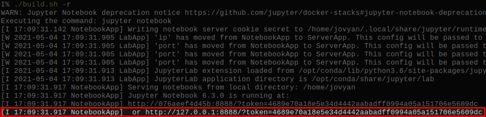
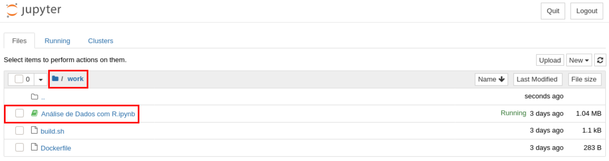

# Exercício Prático: Estatística e Documentos Computacionais


## Dependências

-   Distribuição Linux
    -   Alternativamente, outros sistemas que suportem Docker
-   Bash, ou outro emulador de terminal
-   [Git](https://git-scm.com/downloads)
-   [Docker](https://docs.docker.com/get-docker/)


## Inicialização do Exercício

-   Clone o repositório do curso:

``` bash
git clone https://github.com/phrb/PPD.git
```

-   Construa a imagem do **Docker**:

``` bash
cd lectures/org/reprodutibilidade/exercicio_pratico && ./build.sh -b
```

-   Inicie o servidor **Jupyter**:

``` bash
./build.sh -r
```

-   Pelo seu *browser*, acesse o servidor **Jupyter** usando o *token* gerado:



-   Na pasta *work*, abra o notebook do exercício:



-   Todos  os pacotes  *R* e  *datasets* já  estão instalados  no *notebook*,  e o
    exercício continua lá
